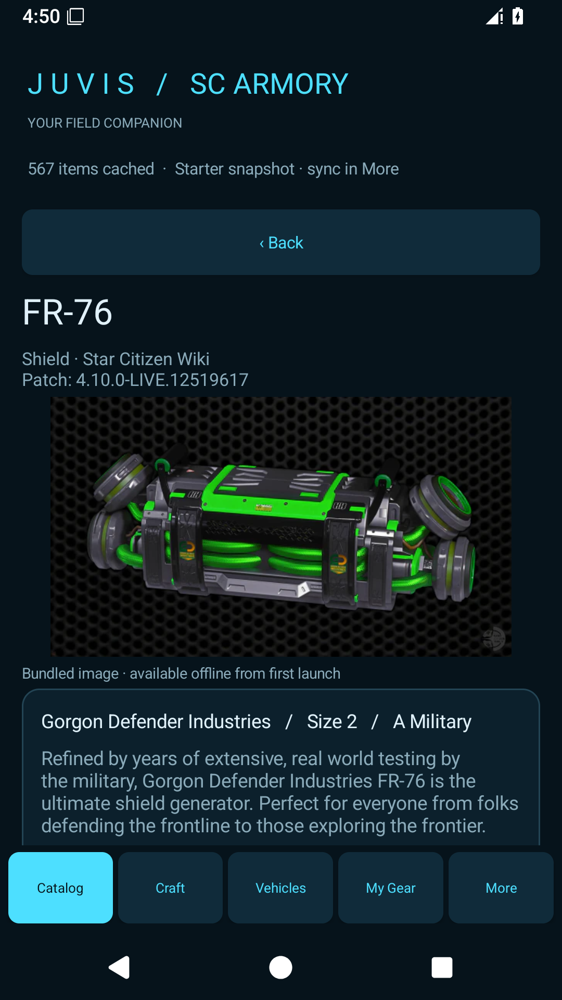

# JUVIS SC ARMORY — Android

<p align="center"></p>

[User guide](docs/USER-GUIDE.md) · [Downloads](https://github.com/mynamejuv-gif/JUVIS-SC-ARMORY/releases) · [Build instructions](#build-on-windows) · [Release history](CHANGELOG.md) · [Contributing](CONTRIBUTING.md)

A native Android companion for Star Citizen, written in C# with .NET for Android. Minimum Android 8 (API 26); ARM64 phones and x64 emulators.

This is a starter implementation of the described Windows workflows. The original Windows source was unavailable, so complete desktop feature parity has not been established.

## Features

- Searchable item catalog, item images and downloaded-image cache.
- Commodities, blueprints and crafting hub.
- My Gear states and backup import/export.
- Vehicle loadouts and proposed upgrades.
- Gemini deep-link buttons for suggestions.
- UEX and Star Citizen Wiki synchronization.
- Mobile navigation and dark styling inspired by the Windows app.



## Install on Android

Open [Releases](https://github.com/mynamejuv-gif/JUVIS-SC-ARMORY/releases) and choose a signed APK from the available release assets. Use the full-images APK for bundled offline pictures, or the lightweight APK for a smaller download. Transfer it to your phone, open it in Files, allow installation from that app if prompted, then tap Install. Export your JUVIS backup before uninstalling an existing version. AAB files and source ZIPs are not directly installable.

Read the [illustrated user guide](docs/USER-GUIDE.md) for the first-run walkthrough and everyday tasks.

## Images

This repository is the lightweight source edition. It includes a partial starter dataset and an empty bundled-image index. Images can download and cache when online. The full-image edition includes 3,730 images (about 736 MiB uncompressed); keep that pack and installable packages as separate release downloads, outside ordinary Git history.

To include your original image ZIP, run from the repository folder:

```powershell
dotnet run --project tools/Juvis.ImagePack -- "C:\path\BundledData (2).zip" .local-image-pack
./Build-Android.ps1 -ImagePackDirectory .local-image-pack
```

Use an empty output folder for the importer. It preserves image bytes and creates the required index. Set `ANDROID_HOME` and `JAVA_HOME`, or pass the SDK/JDK arguments below. If you already have the full source edition, pass its `BundledData` folder directly with `-ImagePackDirectory`. Do not replace the repository's empty index with a populated index without supplying its images.

## Build on Windows

Install PowerShell 7 and .NET SDK 10 (tested with 10.0.401). Open PowerShell in this folder. First build, including Android SDK/JDK installation:

```powershell
./Build-Android.ps1 -InstallDependencies `
  -AndroidSdkDirectory "$env:LOCALAPPDATA\Juvis\android-sdk" `
  -JavaSdkDirectory "$env:LOCALAPPDATA\Juvis\jdk"
```

The script accepts Android SDK licenses during dependency installation. Later builds can omit `-InstallDependencies` and use the same SDK/JDK arguments. The script runs the core tests before building. Install the `*-Signed.apk` from `artifacts` on an Android device. AAB bundles are for distribution tooling, not direct installation. Add `-Format aab` to build one.

Run tests alone:

```powershell
dotnet run --project tests/Juvis.Core.Tests.csproj -c Release
```

Packages are development builds. Configure a stable private signing key before distributing updates or publishing to a store. GitHub runners generate temporary debug keys: builds from different runners may not install as updates over one another. Export your in-app backup before changing builds that use different signing keys.

## GitHub

Follow [the upload guide](docs/GITHUB-SETUP.md). The included GitHub Actions workflow builds a lightweight debug APK on pushes to `main`, pull requests, or manual runs. Download it from the completed run's Artifacts section. No repository secrets are required, and the workflow does not publish releases.

## Source layout

| Folder | Contents |
| --- | --- |
| `src/Juvis.Core` | Models, parsers, storage, synchronization and planning |
| `src/Juvis.Android` | Native Android screens and resources |
| `tests` | 35 executable core tests and fixtures |
| `tools/Juvis.ImagePack` | Local image-pack importer |
| `BundledData` | Empty default image index |
| `docs` | Architecture, verification, device checklist and screenshots |

The full-image edition was tested on an Android 16 emulator. Historical full-image verification is recorded in [VERIFICATION.md](docs/VERIFICATION.md); [FULL-IMAGE-EDITION.md](docs/FULL-IMAGE-EDITION.md) describes that separate package. GitHub-hosted workflow execution remains to be verified after upload. Vehicle recommendations depend on available API data and are not a ship-performance simulator.

This is an unofficial fan companion. Star Citizen content and images belong to their respective owners. Data sources include UEX and Star Citizen Wiki. No third-party image ownership or license is granted by this repository.


