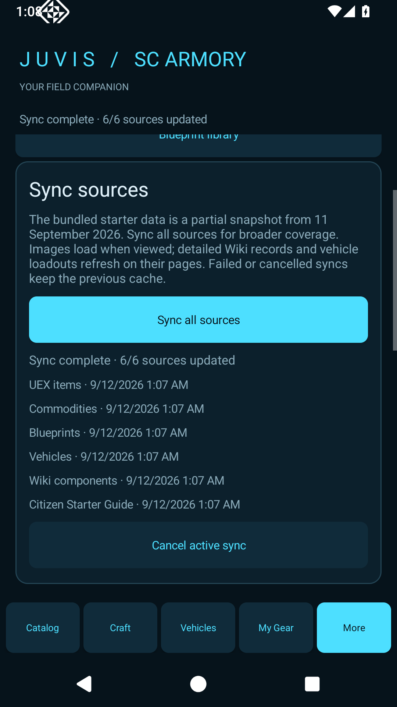

# JUVIS Android 0.1.6 — Sync all sources

In **More**, tap **Sync all sources** to update UEX items, commodities, blueprints, vehicles, Wiki components and Citizen Starter Guide reports in one run. Progress identifies the current source. A failed source retains its cache while the next source continues. The final report lists failures and every source retains its last successful update time.

**Cancel active sync** stops remaining work while keeping completed updates. Images load when viewed; detailed Wiki records, recipe unlocks and stock vehicle loadouts still refresh on their respective pages.

Install the 0.1.6 APK over the existing app and choose **Update**. Do not uninstall first; exporting a backup from More is recommended. This remains a private review build.

Validation: 54 core tests pass, including failure continuation, timeout handling and cancellation. Android emulator upgrade installation passed. A live run completed all six sources successfully.

## Thanks to our data sources

Thank you to the maintainers and community contributors behind these resources:

- [UEX](https://uexcorp.space/) — item, commodity and vehicle reference data.
- [Star Citizen Wiki](https://starcitizen.tools/) and its [API](https://api.star-citizen.wiki/) — item details, components, blueprints, recipes and available unlock information.
- [Citizen Starter Guide](https://citizen-starter-guide.com/) — community blueprint and mission reports through its [Blueprint Finder](https://citizen-starter-guide.com/star-citizen-blueprint-finder/).

Your work makes JUVIS possible. Source names and update times remain visible so users can check the original information. JUVIS is an independent fan project; these credits do not imply endorsement or ownership of third-party data or images.
