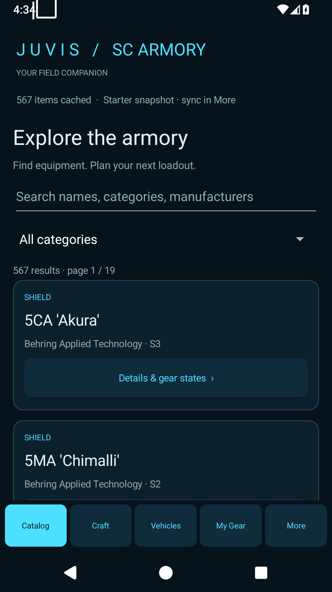
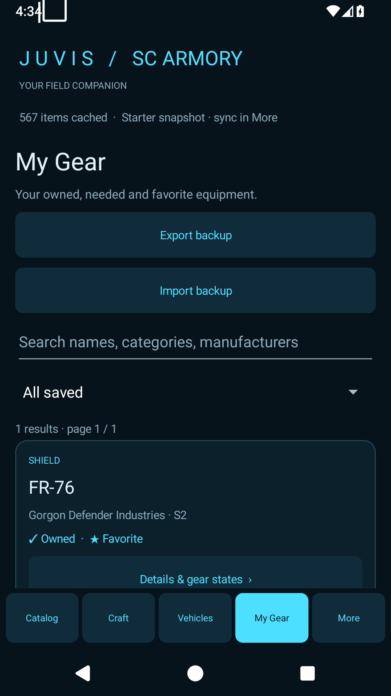
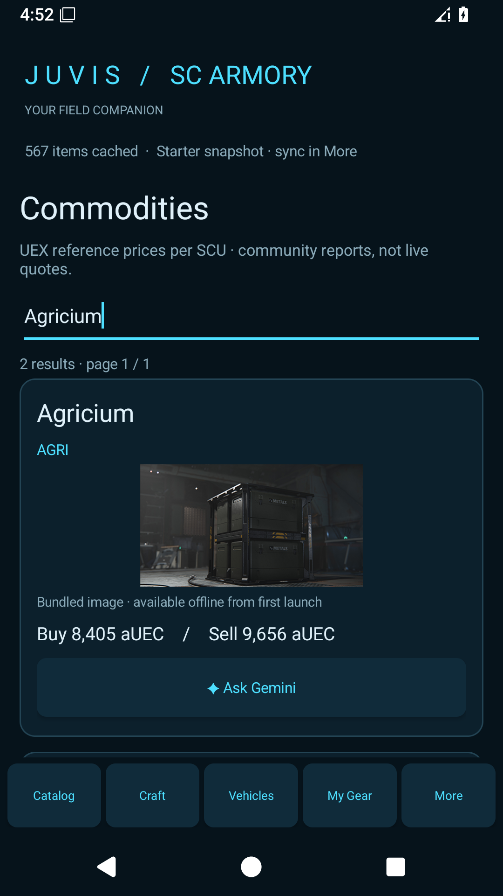
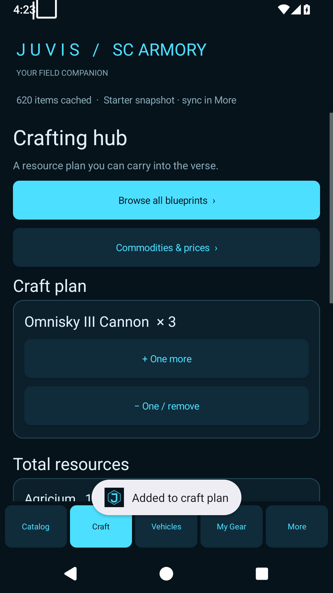
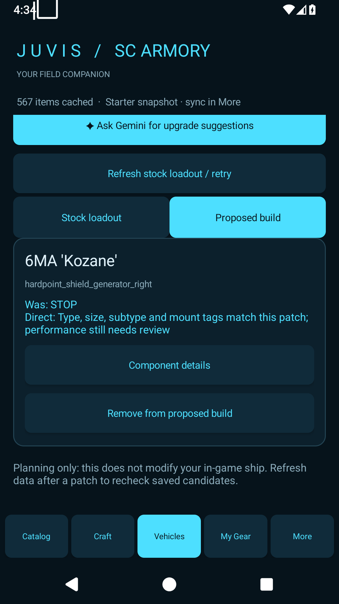

# JUVIS SC ARMORY — Using the Android app

For Android version 0.1.2. This guide explains everyday use after installation.

Screenshots show examples from Android testing. Saved items, prices and catalog counts will vary; some captures are from earlier builds and show the previous icon.

## Start here

1. Open **JUVIS SC ARMORY** on your phone.
2. Browse **Catalog** immediately using the included starter data.
3. Connect to the internet and open **More** to sync additional data. Sync one source at a time and wait for the success message.
4. Open an item's **Details & gear states** and select **Owned**, **Need**, or **Favorite**.
5. Open **My Gear** to see your saved equipment.

The starter catalog is a partial snapshot. A missing search result does not necessarily mean the item is unavailable in the game.

## Find your way around

| Bottom button | What you can do |
| --- | --- |
| **Catalog** | Search equipment, read details and save gear states. |
| **Craft** | Browse recipes and calculate materials for your craft plan. |
| **Vehicles** | Inspect stock loadouts and save proposed upgrades. |
| **My Gear** | Review your owned, needed and favorite equipment. |
| **More** | Open commodities and blueprints, sync data, manage backups and clear downloaded images. |

Use **‹ Back** to return from a detail page. Long lists have **Next page** and **Previous page** buttons near the bottom. Clear the search box and reset filters if results seem to be missing.

## Catalog and item details

*Catalog: search at the top, choose a category, then open Details & gear states.*

1. Tap **Catalog**.
2. Search by name, category or manufacturer. Use the category selector to narrow the list.
3. Tap **Details & gear states** on an item.
4. Review its image, patch, specifications, reported price and any available shop information.
5. Tap **Refresh Wiki details** while online to request additional information.
6. Use **Open source / availability** when that button is available to visit the item's source page.

Unknown values are displayed as unavailable or `?`. Prices and specifications come from cached community data and may have changed since the last sync.

## My Gear

*My Gear: filter saved equipment and find the Export backup and Import backup buttons.*

On an item detail page, check any combination of:

- **Owned** — equipment you have.
- **Need** — equipment you want to obtain.
- **Favorite** — equipment you want to find quickly.

Selections save automatically on this device. Uncheck a state to remove it. Open **My Gear**, then choose **All saved**, **Owned**, **Need**, or **Favorites** to filter your list.

These are your manual records. The app does not read your in-game inventory or purchase equipment.

## Images and offline use

The **full-images APK** includes 3,730 image files. Matching item and commodity images work offline from the first launch. This does not mean every catalog entry has a bundled image.

The **lightweight APK** has no bundled image pack. Item images with a source URL download when you open their details online and are cached for later use. Commodity pictures in this version depend on the bundled pack.

Open **More** to see the bundled-image count and downloaded-cache size. **Clear downloaded images** removes downloaded pictures; it keeps bundled images and your saved gear states. The downloaded cache is limited to 100 MB, so older downloads may need to be fetched again.

Cached catalog data, saved gear, recipes, craft plans and cached vehicle details can be used offline. Syncing, refreshing uncached details, opening source websites and using Gemini require a connection.

## Commodities

*Commodities: an Agricium search with a bundled image, reference prices and the Ask Gemini button.*

1. Open **More → Commodities**, or **Craft → Commodities & prices**.
2. Search by commodity name or code.
3. Review the reported buy and sell prices per SCU and any illegal-commodity label.
4. Tap **Ask Gemini** to research locations, legality and current prices.

The displayed prices are community reference prices, not guaranteed live terminal quotes. Sync **Commodities** in **More** to refresh the cached list.

## Blueprints and crafting

*Crafting hub: a recipe added three times, with quantity controls and the Total resources section below.*

1. Open **Craft → Browse all blueprints**, or **More → Blueprint library**.
2. Search for a blueprint or ingredient.
3. Tap **Recipe & unlocks** to inspect resources per craft, craft time and available mission-unlock information.
4. Tap **Refresh recipe & mission unlocks** if details are missing or outdated.
5. Tap **Mark blueprint owned** when appropriate. Tap the same button again to unmark it.
6. Tap **+ Add one to craft plan**.
7. Return to **Craft** to view **Total resources** for your planned recipes.

Use **+ One more** to increase a recipe quantity. **− One / remove** decreases the quantity and removes the recipe when it reaches zero. **Used in** shows cached blueprints that use a resource.

If a recipe has no quantities, refresh it before adding it. After importing a plan, sync Blueprints if a recipe is not cached. Totals use the cached base recipe; check the source for station, quality and tier requirements. Adding a plan does not craft anything in the game.

## Vehicle loadouts and upgrades

*Proposed build: review the replacement, its fit result, component details and removal button.*

1. Tap **Vehicles** and search for a ship or ground vehicle.
2. Tap **Loadout & upgrades**.
3. Optionally tap **Mark vehicle owned** so it appears under **My vehicles**.
4. Tap **Refresh stock loadout / retry** to download ports and installed components. A request has a 20-second timeout; use the same button to retry if it fails.
5. On **Stock loadout**, filter ports with a term such as `shield`, `cooler` or `weapon`.
6. For an editable port, tap **Show compatible upgrades**.
7. If needed, tap **Sync candidates for this port / retry**.
8. Review candidates. Only those marked **Mount fit confirmed** can be added using **+ Add to proposed build**.
9. Open **Proposed build** to inspect saved replacements or remove them.

**Restriction check required** means available data is insufficient to confirm a fit. Use **Details / refresh restrictions** and refresh the stock loadout as needed. Fixed ports cannot be edited. A confirmed mount fit does not guarantee better performance.

Replacing a parent mount removes saved proposals for its child ports. The app prevents planning stock child ports while their parent has a proposed replacement.

The loadout is the source's stock configuration, not a live read of your personal ship. Proposed builds are local plans and do not modify the game. Refresh vehicle and component data after a game patch to recheck compatibility.

## Ask Gemini

Gemini buttons prepare a research prompt for the item, commodity, recipe or vehicle you are viewing.

1. For vehicle suggestions, select a goal such as **Balanced**, **Combat**, **Defense**, **Fast Travel**, **Stealth**, **Industrial / Mining**, or **Budget**.
2. Tap the relevant **Ask Gemini** button.
3. JUVIS copies the prompt to your clipboard and shows **Prompt copied**.
4. Tap **Open Gemini**.
5. Paste the prompt into a new Gemini chat and send it. Sign in if Gemini asks.
6. Return to JUVIS to review candidates and save changes yourself.

The prompt contains the selected context, including the stock loadout and proposed build for a vehicle. It does not include your full backup. Replies appear in Gemini and are not automatically applied to JUVIS. Check sources and current-patch compatibility before acting on a suggestion.

## Sync data

Open **More**, then choose the source you need:

| Sync button | Updates |
| --- | --- |
| **Sync UEX items** | Equipment catalog from UEX. |
| **Sync Commodities** | Commodity reference data. |
| **Sync Blueprints** | Blueprint and recipe catalog. |
| **Sync Vehicles** | Vehicle list; refresh individual stock loadouts separately. |
| **Sync Wiki components** | Component information from Star Citizen Wiki. |

Watch the status message and wait for completion before starting another sync. **Cancel active sync** stops the current operation. Failed or cancelled syncs retain the previous cache. Each source shows its last successful sync time.

The optional UEX bearer-token field is for users who have a token. Enter it and tap **Use token for this session** when needed. It is kept for the current session and excluded from backups.

## Back up and restore

### Save a backup

1. Open **More → Export backup to a file**, or **My Gear → Export backup**.
2. Choose a location outside the app, such as Downloads or a cloud folder offered by Android's file picker.
3. Save the `JUVIS-backup-....json` file and keep a copy before uninstalling or changing phones.

The backup includes gear states, favorites, owned blueprints, the craft plan, owned vehicles and proposed builds. It excludes catalog data, images and tokens.

### Restore a backup

1. Open **More → Import & merge backup**, or **My Gear → Import backup**.
2. Select a JUVIS Android backup JSON file.
3. Review the summary and tap **Import**.
4. Sync missing catalogs afterwards to restore associated details.

Import merges data. Imported values win when the same record exists in both places; unrelated records remain. The app saves a local copy of the previous state before merging. Backups larger than 8 MB are rejected. Windows desktop backup migration is not supported yet.

## Common problems

| Problem | Try this |
| --- | --- |
| No search results | Clear the search, reset the filter, then sync the relevant source in More. |
| No image | Use the full-image edition for bundled pictures, or connect and refresh item details. Some entries have no image. |
| No vehicle ports | Open the vehicle and tap Refresh stock loadout / retry. |
| No upgrade candidates | Sync candidates for the selected editable port. |
| Cannot add an upgrade | Check its restriction status and whether its parent mount has already been replaced in the proposed build. |
| Missing crafting totals | Refresh the recipe or sync Blueprints so quantities are cached. |
| Gemini opens without your question | Paste the prompt from the clipboard into a new Gemini chat. |
| Sync fails | Check the connection, wait and retry. Your previous cache remains available. |
| Imported gear has few details | Sync its catalog. Saved states can appear before the corresponding catalog entry is downloaded. |

Use **More → Export backup to a file** regularly to keep your plans portable.

